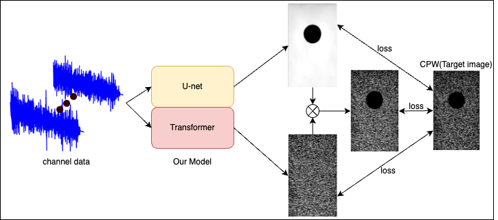

# A Hybrid Model Combining U-net and Transformers for Joint Segmentation and Beamforming of Plane-Wave Ultrasound Images

This repository contains the source code for our paper:   
**"A Hybrid Model Combining U-net and Transformers for Joint Segmentation and Beamforming of Plane-Wave Ultrasound Images"**  
Submitted in **[IEEE T-UFFC, 2025]**.  

---

## Abstract
  Recent advancements in deep learning have shown significant potential in ultrasound imaging. However, most approaches focus solely on either image enhancement or segmentation without integrating these tasks into a unified framework. To address this, we propose a novel deep learning architecture combining U-Net and Transformer models to simultaneously segment and beamform plane-wave images from a single insonification. We evaluated the hybrid U-Net/Transformer network using simulated and physical phantoms containing hypoechoic inclusions (5–10 mm radius). Image quality was assessed using six metrics: Laplacian variance (LV), mean-square error (MSE), generalized contrast-to-noise ratio (gCNR), structural similarity index metric (SSIM), signal-to-noise ratio (SNR), and Dice similarity coefficient (DSC). The hybrid model achieved a DICE score of 0.98, low MSE (0.017), and high SSIM (0.765), demonstrating excellent image quality. Beamforming performance was comparable to compounding plane-wave (CPW) imaging, with SNR and gCNR values of 2.15 and 0.8, respectively, versus 2.4 and 0.9 for CPW imaging. Despite improved tissue boundary definition and reduced artifacts, the hybrid model produced very few erroneous results for inclusions $\leq$7 mm, likely due to limitations in the loss function or training data diversity. Nonetheless, its robust performance across varying scaling parameters warrants further exploration into loss function optimization, dataset diversity, and clinical applicability to enhance generalization across different imaging scenarios.

```

```

## Requirements

scipy == 1.11.3
torch == 2.1.0
torchaudio == 2.1.0
torchvision == 0.16.0

## Dataset
Simulation data was generated by Filed II Matlab code.
Phantom data was collected by Verasonic System.
